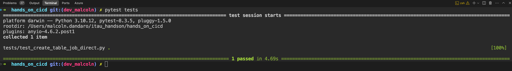
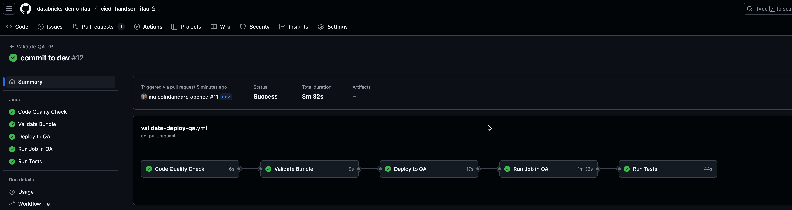
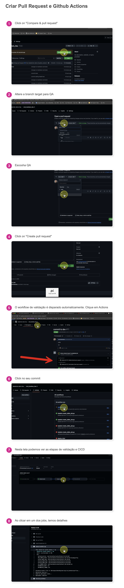

# CI/CD Hands-On com Databricks

Este repositório contém o código e configurações necessárias para o workshop de CI/CD com Databricks.

Por se tratar de um workshop, o código fonte do job foi simplificado para fins didáticos.

Devido à complexidade de demonstrar um cenário end-to-end completo de CI/CD (que envolve Git, CLI, runners e outros objetos externos), este repositório foi preparado com uma estrutura pronta contendo os seguintes assets do Databricks:

- Notebook que cria uma tabela de funcionários
- Workflow configurado para executar este Notebook
- Testes unitários previamente definidos
- Esteira de CI/CD utilizando GitHub Actions já configurada

## Índice

1. [Pré-requisitos](#pré-requisitos)
2. [Ferramentas Utilizadas](#ferramentas-utilizadas)
3. [Passo a Passo](#passo-a-passo)
   - [Passo 1: Instalação do Databricks CLI](#passo-1-instalação-do-databricks-cli)
   - [Passo 2: Clone do Repositório](#passo-2-clone-do-repositório)
   - [Passo 3: Importação de um Job Existente](#passo-3-importação-de-um-job-existente)
   - [Passo 4: Configuração de Variáveis de Ambiente](#passo-4-configuração-de-variáveis-de-ambiente)
   - [Passo 5: Deployment em Diferentes Ambientes](#passo-5-deployment-em-diferentes-ambientes)
   - [Passo 6: Executando o Job](#passo-6-executando-o-job)
4. [Executando Testes Unitários e de Integração](#executando-testes-unitários-e-de-integração)
   - [Sobre o Databricks Connect](#sobre-o-databricks-connect)
   - [Pré-requisitos para os Testes](#pré-requisitos-para-os-testes)
   - [Estrutura dos Testes](#estrutura-dos-testes)
   - [Executando os Testes](#executando-os-testes)
5. [Validação de Código Estático com Flake8](#validação-de-código-estático-com-flake8)
6. [GitHub Actions](#github-actions)
   - [Fluxo de Trabalho com GitHub Actions](#fluxo-de-trabalho-com-github-actions)
7. [Referência](#referência)
   - [Estrutura do Repositório](#estrutura-do-repositório)

## Pré-requisitos

- Conhecimento prévio de Git
- Conhecimento prévio dos conceitos de CI/CD
- Acesso a um workspace Databricks
- Token de acesso ao Databricks

## Ferramentas Utilizadas

Neste workshop, utilizaremos as seguintes ferramentas para implementar o pipeline de CI/CD:

### Databricks CLI
A [Databricks CLI](https://docs.databricks.com/aws/en/dev-tools/cli/) é uma interface de linha de comando que permite interagir com a plataforma Databricks a partir do seu terminal local ou scripts de automação. Ela encapsula a API REST do Databricks, fornecendo endpoints para modificar ou solicitar informações sobre objetos do workspace Databricks.

### Databricks Asset Bundles
[Databricks Asset Bundles](https://docs.databricks.com/aws/en/dev-tools/bundles) são uma ferramenta que facilita a adoção de boas práticas de engenharia de software, incluindo controle de código-fonte, revisão de código, testes e integração contínua e entrega (CI/CD) para seus projetos de dados e IA. Os bundles permitem descrever recursos do Databricks como jobs, pipelines e notebooks como arquivos de origem.

### Databricks Connect
[Databricks Connect](https://docs.databricks.com/aws/en/dev-tools/databricks-connect/python/) é uma biblioteca cliente que permite conectar seu ambiente de desenvolvimento local ao Databricks. Isso possibilita:
- Desenvolvimento local
- Integração contínua
- Depuração remota
- Execução de testes automatizados que interagem com o ambiente Databricks

### GitHub Actions
[GitHub Actions](https://github.com/features/actions) é uma plataforma de automação que permite criar fluxos de trabalho de CI/CD diretamente no seu repositório GitHub. Com o GitHub Actions, você pode automatizar, personalizar e executar seus fluxos de trabalho de desenvolvimento de software diretamente no GitHub.

## Passo a Passo

### Passo 1: Instalação do Databricks CLI

Instale o Databricks CLI utilizando pip:

```bash
pip install databricks-cli
```

Gere o token de acesso ao Databricks (vamos utilizar no proximo passo)


Configure o acesso ao Databricks:

```bash
databricks configure --token
```

Você será solicitado a fornecer:
- URL do seu workspace Databricks (ex: https://adb-123456789.4.azuredatabricks.net)
- Token de acesso pessoal

Também é possivel utilizar authenticação via browser, caso prefira.

### Passo 2: Clone do Repositório

Clone este repositório para o seu ambiente local:

```bash
git clone https://github.com/databricks-demo-itau/cicd_handson_itau

cd cicd_handson_itau
```
O repositorio já está configurado com um job existente, que cria uma tabela de funcionários. e um workflow configurado para executar este job.
Caso você deseje utilizar um job diferente, você pode seguir o passo 3.
### (Opcional) Passo 3: Importação de um Job Existente

Para começar, importe um job existente do Databricks:

```bash
databricks bundle generate job --existing-job-id 663063874671210 -t dev
```

Onde:
- `--existing-job-id 663063874671210` especifica o ID do job que você deseja importar
- `-t dev` especifica o ambiente de destino (target environment) de onde o job será importado

Este comando irá gerar os arquivos de configuração necessários para que você possa trabalhar com o job localmente.

#### Exemplo de Execução

Quando executamos o comando para importar um job existente:

```bash
> databricks bundle generate job --existing-job-id 393880860618601 -t dev -p itaudev
File successfully saved to src/create_table_job.py
Job configuration successfully saved to resources/lab_cicd_criar_tabela_funcionario.yml
```

Como podemos observar:
- O arquivo SQL do job foi salvo no diretório `src/`
- A configuração do job foi salva no diretório `resources/`

### Passo 4: Configuração de Variáveis de Ambiente

#### Configuração do Catálogo

No job importado (lab_cicd_criar_tabela_funcionario.job.yml.job.yml), usamos variáveis parametrizadas para garantir a portabilidade entre diferentes ambientes:

```
catalogo: ${catalogo}
```

Essa abordagem permite que o mesmo job seja executado em diferentes ambientes (dev, qa, prod), utilizando o catálogo apropriado para cada um.

#### Como Funciona

1. No arquivo `databricks.yml`, definimos os diferentes ambientes e suas respectivas configurações.
2. Para cada ambiente (target), especificamos o valor que deve ser usado para a variável `catalogo`.
3. Quando implantamos ou executamos o job em um ambiente específico, o sistema substitui a variável `${catalogo}` pelo valor configurado para aquele ambiente.

Por exemplo:
- No ambiente `dev`, `${catalogo}` pode ser substituído por `catalogo_dev`
- No ambiente `qa`, `${catalogo}` pode ser substituído por `catalogo_qa`
- No ambiente `prod`, `${catalogo}` pode ser substituído por `catalogo_prod`

### Passo 5: Deployment em Diferentes Ambientes

Para fazer o deployment do job para um ambiente específico:

```bash
databricks bundle deploy -t dev
```

Este comando implantará o job no ambiente de desenvolvimento (`dev`), substituindo a variável `${catalogo}` pelo valor definido para este ambiente.

Para implantar em outros ambientes:

```bash
databricks bundle deploy -t qa     # Deploy para ambiente de QA
databricks bundle deploy -t prod   # Deploy para ambiente de produção
```

### Passo 6: Executando o Job

Para executar o job em um ambiente específico:

```bash
databricks bundle run -t dev
```
*Caso exista mais de um job no bundle, será solicitado qual job você deseja executar.*


#### Resultado do Deployment

Após executar o comando de deployment, o job será criado no Databricks com o usuário logado como proprietário:


Observe que:
- O nome do job inclui um prefixo indicando o ambiente (`[dev_alfeu_duran]`)
- O usuário que executou o comando de deployment é automaticamente definido como o proprietário do job
- As tags do job são preservadas durante o deployment

## Executando Testes Unitários e de Integração

Este projeto utiliza pytest para testes unitários e o Databricks Connect para executar testes que interagem com um ambiente Databricks.

### Sobre o Databricks Connect

Databricks Connect é uma biblioteca cliente que permite conectar seu ambiente de desenvolvimento local ao Databricks. Isso possibilita:

- **Desenvolvimento local**: Escrever e testar código localmente antes de implantá-lo no Databricks
- **Integração contínua**: Executar testes automatizados que interagem com o ambiente Databricks
- **Depuração remota**: Depurar código que será executado no cluster Databricks diretamente da sua IDE

Com o Databricks Connect, seus testes podem:
1. Criar e manipular tabelas no Databricks
2. Executar consultas SQL e verificar resultados
3. Simular a execução de jobs exatamente como aconteceria no ambiente Databricks
4. Acessar o Unity Catalog, Delta Lake e outras funcionalidades do Databricks

Isso elimina a necessidade de mocks extensivos e permite testes mais realistas que validam a interação completa com a plataforma Databricks.

### Pré-requisitos para os Testes

1. Instalação das dependências de teste:
   ```bash
   pip install -r requirements.txt
   ```
2. Databricks CLI configurada (feito no inicio deste documento)


### Estrutura dos Testes

Os testes são organizados da seguinte forma:

- `tests/test_create_table_job.py`: Testes para validar a criação de tabelas e manipulação de dados no Databricks

Estes testes simplificados, Unitarios e de Integração, verificam:
1. Verificam se a tabela foi criada
1. Verificam a estrutura da tabela criada (colunas esperadas)
2. Verificam a contagem de registros inseridos na tabela
3. Verificam se existem valores nulos no campo CPF
3. Verificam se um registro específico está presente na tabela

### Executando os Testes

**Importante**: Os testes estão configurados para serem executados após a criação da tabela no catálogo `hml_hands_on`. Isso é definido no arquivo `tests/test_create_table_job_direct.py`, que verifica a existência e o conteúdo da tabela neste catálogo específico.
Altere as variaveis de ambiente para o catalogo e schema correto antes de executar os testes.

- O catalogo padrao setado é: `hml_hands_on`  (se estiver rodando no ambiente de dev, alterar para `dev_hands_on`)

- O schema setado é: `alfeu_duran` (alterar para o schema do seu usuário, que foicriado automaticamente no momento que foi executado o job)


Para executar todos os testes (após a execução do job e alterar as variaveis no arquivo do pytest):
```bash
pytest tests/
```



Para executar um teste específico:
```bash
pytest tests/test_create_table_job.py
```

Para executar com informações detalhadas:
```bash
pytest tests/ -v
```

## Validação de Código Estático com Flake8

O Flake8 é um linter que verifica a qualidade do código Python. Ele é configurado para verificar:

- Erros de sintaxe
- Erros de estilo
- Erros de complexidade

Configuramos o Flake8 para verificar o código no momento do CI/CD com Github Actions.


## GitHub Actions

Para automatizar o processo de CI/CD, foi configurado um workflow no GitHub Actions. O arquivo `.github/workflows/validate-deploy-qa.yml` define o pipeline que é executado quando um Pull Request é aberto ou atualizado na branch `qa`.



Nossa pipeline será composta por 5 jobs sequenciais, que serão explicados em detalhes abaixo:

1. **Code Quality Check**
   - Verifica a qualidade do código usando Flake8
   - Analisa complexidade e estilo do código
   - Garante que não há erros de sintaxe

2. **Validate Bundle**
   - Valida a configuração do bundle do Databricks
   - Verifica se todas as configurações estão corretas para o ambiente QA

3. **Deploy to QA**
   - Faz o deploy do job para o ambiente QA
   - Utiliza as credenciais configuradas no GitHub Secrets

4. **Run Job in QA**
   - Executa o job no ambiente QA
   - Verifica se o job é executado com sucesso

5. **Run Tests**
   - Executa os testes unitários e de integração
   - Verifica se os testes passam após o deploy


## Fluxo de Trabalho com GitHub Actions
Imagem visual sobre o fluxo de trabalho com GitHub Actions:




O fluxo de trabalho com GitHub Actions segue os seguintes passos:

1. **Desenvolvimento na Branch Dev**
   - Os desenvolvedores realizam seus commits na branch `dev`
   - Esta é a branch de desenvolvimento onde as novas features são implementadas

2. **Pull Request para QA**
   - Quando o código está pronto, é criado um Pull Request de `dev` para `qa`
   - Este processo pode ser automatizado com ferramentas como o GitHub Auto-PR
   - O PR dispara automaticamente o workflow de validação

3. **Execução do Workflow**
   - O workflow definido em `.github/workflows/validate-deploy-qa.yml` é executado
   - Todos os 5 jobs são executados sequencialmente
   - Qualquer falha em um dos jobs interrompe o processo

4. **Proteção da Branch QA**
   - A branch `qa` é protegida por regras de branch protection
   - O merge só é permitido se todos os checks do workflow passarem
   - Isso garante que apenas código validado chegue ao ambiente de QA

5. **Merge ou Rejeição**
   - Se todos os checks passarem, o PR pode ser aprovado e merged
   - Se houver falhas, o PR é bloqueado até que os problemas sejam corrigidos
   - O desenvolvedor recebe feedback imediato sobre qualquer problema

Este fluxo garante a qualidade do código e a integridade do ambiente de QA, estabelecendo um processo robusto de CI/CD.


Exemplo de configuração do workflow:

```yaml
name: Validate QA PR

on:
  pull_request:
    branches:
      - qa
    types: [opened, synchronize, reopened]

jobs:
  code_quality:
    name: Code Quality Check
    runs-on: ubuntu-latest
    steps:
      - name: Checkout code
        uses: actions/checkout@v4
      
      - name: Set up Python
        uses: actions/setup-python@v4
        with:
          python-version: '3.10'
      
      - name: Install Flake8
        run: |
          python -m pip install --upgrade pip
          pip install flake8
          
      - name: Run Flake8
        run: |
          flake8 src/ --count --select=E9,F63,F7,F82 --ignore=F821 --show-source --statistics
```

Este workflow garante que:
- O código está em conformidade com os padrões de qualidade
- O bundle está configurado corretamente
- O deploy é realizado com sucesso
- O job é executado corretamente
- Os testes passam após o deploy

Para que o workflow funcione corretamente, é necessário configurar os seguintes secrets no GitHub:
- `DATABRICKS_HOST_HML`: URL do workspace Databricks
- `DATABRICKS_TOKEN_HML`: Token de acesso ao Databricks

---

## Referência

- [Databricks CLI](https://docs.databricks.com/aws/en/dev-tools/cli/)
- [Databricks Asset Bundles](https://docs.databricks.com/aws/en/dev-tools/bundles)
- [Databricks Connect](https://docs.databricks.com/aws/en/dev-tools/databricks-connect/python/)