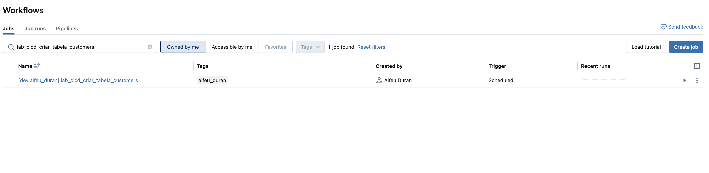

# CI/CD Hands-On com Databricks

Este repositório contém o código e configurações necessárias para o workshop de CI/CD com Databricks.

## Índice

1. [Pré-requisitos](#pré-requisitos)
2. [Passo a Passo](#passo-a-passo)
   - [Passo 1: Instalação do Databricks CLI](#passo-1-instalação-do-databricks-cli)
   - [Passo 2: Clone do Repositório](#passo-2-clone-do-repositório)
   - [Passo 3: Importação de um Job Existente](#passo-3-importação-de-um-job-existente)
   - [Passo 4: Configuração de Variáveis de Ambiente](#passo-4-configuração-de-variáveis-de-ambiente)
   - [Passo 5: Deployment em Diferentes Ambientes](#passo-5-deployment-em-diferentes-ambientes)
3. [Executando Testes](#executando-testes-unitários)
   - [Sobre o Databricks Connect](#sobre-o-databricks-connect)
   - [Testes Completos](#pré-requisitos-para-os-testes)
   - [Testes Simplificados](#testes-simplificados-para-laboratório)
   - [Testes de Integração](#teste-direto-de-integração)
4. [GitHub Actions para CI/CD](github-actions.md)
5. [Referência](#referência)
   - [Estrutura do Repositório](#estrutura-do-repositório)

## Pré-requisitos

- Python 3.8 ou superior
- Acesso a um workspace Databricks
- Token de acesso ao Databricks

## Passo a Passo

### Passo 1: Instalação do Databricks CLI

Instale o Databricks CLI utilizando pip:

```bash
pip install databricks-cli
```

Configure o acesso ao Databricks:

```bash
databricks configure --token
```

Você será solicitado a fornecer:
- URL do seu workspace Databricks (ex: https://adb-123456789.4.azuredatabricks.net)
- Token de acesso pessoal

### Passo 2: Clone do Repositório

Clone este repositório para o seu ambiente local:

```bash
git clone <URL_DO_REPOSITORIO>
cd cicd_handson_itau
```

### (Opcional) Passo 3: Importação de um Job Existente

Para começar, importe um job existente do Databricks:

```bash
databricks bundle generate job --existing-job-id 663063874671210 -t dev
```

Onde:
- `--existing-job-id 663063874671210` especifica o ID do job que você deseja importar
- `-t dev` especifica o ambiente de destino (target environment) de onde o job será importado

Este comando irá gerar os arquivos de configuração necessários para que você possa trabalhar com o job localmente.

#### Exemplo de Execução

Quando executamos o comando para importar um job existente:

```bash
> databricks bundle generate job --existing-job-id 393880860618601 -t dev -p itaudev
File successfully saved to src/create_table_job.py
Job configuration successfully saved to resources/rls_column_masking_job.yml
```

Como podemos observar:
- O arquivo SQL do job foi salvo no diretório `src/`
- A configuração do job foi salva no diretório `resources/`

### Passo 4: Configuração de Variáveis de Ambiente

#### Configuração do Catálogo

No job importado (lab_cicd_criar_tabela_customers.job.yml), usamos variáveis parametrizadas para garantir a portabilidade entre diferentes ambientes:

```
catalogo: ${catalogo}
```

Essa abordagem permite que o mesmo job seja executado em diferentes ambientes (dev, qa, prod), utilizando o catálogo apropriado para cada um.

#### Como Funciona

1. No arquivo `databricks.yml`, definimos os diferentes ambientes e suas respectivas configurações.
2. Para cada ambiente (target), especificamos o valor que deve ser usado para a variável `catalogo`.
3. Quando implantamos ou executamos o job em um ambiente específico, o sistema substitui a variável `${catalogo}` pelo valor configurado para aquele ambiente.

Por exemplo:
- No ambiente `dev`, `${catalogo}` pode ser substituído por `catalogo_dev`
- No ambiente `qa`, `${catalogo}` pode ser substituído por `catalogo_qa`
- No ambiente `prod`, `${catalogo}` pode ser substituído por `catalogo_prod`

### Passo 5: Deployment em Diferentes Ambientes

Para fazer o deployment do job para um ambiente específico:

```bash
databricks bundle deploy -t dev
```

Este comando implantará o job no ambiente de desenvolvimento (`dev`), substituindo a variável `${catalogo}` pelo valor definido para este ambiente.

Para implantar em outros ambientes:

```bash
databricks bundle deploy -t qa     # Deploy para ambiente de QA
databricks bundle deploy -t prod   # Deploy para ambiente de produção
```

#### Resultado do Deployment

Após executar o comando de deployment, o job será criado no Databricks com o usuário logado como proprietário:



Observe que:
- O nome do job inclui um prefixo indicando o ambiente (`[dev_alfeu_duran]`)
- O usuário que executou o comando de deployment é automaticamente definido como o proprietário do job
- As tags do job são preservadas durante o deployment

## Executando Testes Unitários

Este projeto utiliza pytest para testes unitários e o Databricks Connect para executar testes que interagem com um ambiente Databricks.

### Sobre o Databricks Connect

Databricks Connect é uma biblioteca cliente que permite conectar seu ambiente de desenvolvimento local ao Databricks. Isso possibilita:

- **Desenvolvimento local**: Escrever e testar código localmente antes de implantá-lo no Databricks
- **Integração contínua**: Executar testes automatizados que interagem com o ambiente Databricks
- **Depuração remota**: Depurar código que será executado no cluster Databricks diretamente da sua IDE

Com o Databricks Connect, seus testes podem:
1. Criar e manipular tabelas no Databricks
2. Executar consultas SQL e verificar resultados
3. Simular a execução de jobs exatamente como aconteceria no ambiente Databricks
4. Acessar o Unity Catalog, Delta Lake e outras funcionalidades do Databricks

Isso elimina a necessidade de mocks extensivos e permite testes mais realistas que validam a interação completa com a plataforma Databricks.

### Pré-requisitos para os Testes

1. Instalação das dependências de teste:
   ```bash
   pip install -r requirements.txt
   ```

2. Configuração do Databricks Connect:
   
   Exporte as variáveis de ambiente necessárias:
   ```bash
   export DATABRICKS_HOST=<seu-host-databricks> # Ex: https://adb-123456789.4.azuredatabricks.net
   export DATABRICKS_TOKEN=<seu-token-de-acesso>
   ```

   Ou configure utilizando a CLI do Databricks:
   ```bash
   databricks configure --token
   ```

### Executando os Testes

Para executar todos os testes:
```bash
pytest tests/
```

Para executar um teste específico:
```bash
pytest tests/test_create_table_job.py
```

Para executar com informações detalhadas:
```bash
pytest tests/ -v
```

### Estrutura dos Testes

Os testes são organizados da seguinte forma:

- `tests/test_create_table_job.py`: Testes para validar a criação de tabelas e manipulação de dados no Databricks

Os testes utilizam um ambiente isolado no Unity Catalog para não interferir com os dados de produção. 

### Testes Simplificados para Laboratório

Para fins de demonstração e laboratório, fornecemos uma versão simplificada dos testes:

```bash
# Instalar dependências mínimas
pip install -r requirements-test-simple.txt

# Executar os testes simplificados
pytest tests/test_create_table_job_simple.py -v

# Ou usar o script auxiliar
./run_simple_tests.sh
```

Estes testes simplificados:
1. Testam a função de obtenção do nome do esquema
2. Verificam a recuperação correta do catálogo a partir dos widgets
3. Validam os comandos SQL executados

### Teste Direto de Integração

Também fornecemos um teste de integração direto:

```bash
# Executar o teste direto
pytest tests/test_create_table_job_direct.py -v

# Ou usar o script auxiliar
./run_direct_test.sh
```

Este teste:
1. Executa o script create_table_job.py diretamente
2. Verifica se a tabela foi criada com o schema correto
3. Valida se todos os dados foram inseridos corretamente
4. Verifica um registro específico que deve estar presente na tabela

## Referência

### Estrutura do Repositório

- `databricks.yml` - Arquivo de configuração principal do Databricks
- `src/` - Contém o código fonte dos notebooks e jobs
- `resources/` - Contém recursos adicionais necessários para os jobs

---

*Nota: Esta documentação poderá ser atualizada ao longo do desenvolvimento do projeto.* 